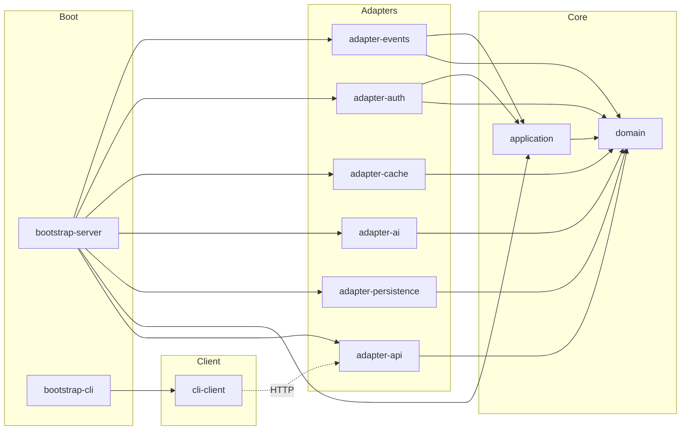
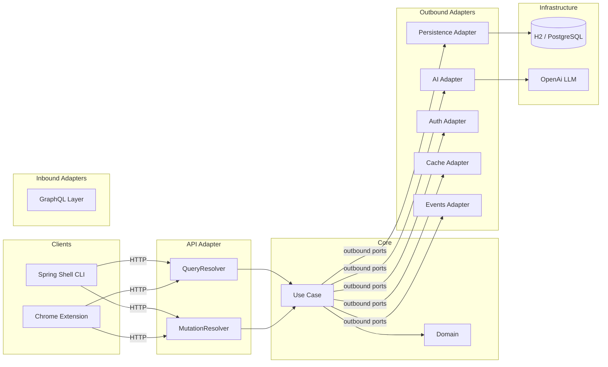
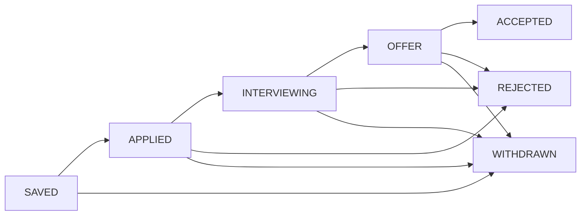

[](LICENSE)
[](https://juanpablojimenezesclusa.github.io/alexandra-job-tracker/)

---

<p align="center">
  <a href="https://sonarcloud.io/summary/new_code?id=JuanPabloJimenezEsclusa_alexandra-job-tracker"></a>
  <a href="https://sonarcloud.io/summary/new_code?id=JuanPabloJimenezEsclusa_alexandra-job-tracker"></a>
  <a href="https://sonarcloud.io/summary/new_code?id=JuanPabloJimenezEsclusa_alexandra-job-tracker"></a>
  <a href="https://sonarcloud.io/summary/new_code?id=JuanPabloJimenezEsclusa_alexandra-job-tracker"></a>
  <a href="https://sonarcloud.io/summary/new_code?id=JuanPabloJimenezEsclusa_alexandra-job-tracker"></a>
  <a href="https://sonarcloud.io/summary/new_code?id=JuanPabloJimenezEsclusa_alexandra-job-tracker"></a>
</p>

<p align="center">
  <a href="https://github.com/JuanPabloJimenezEsclusa/alexandra-job-tracker/actions/workflows/ci.yml"></a>
  <a href="https://github.com/JuanPabloJimenezEsclusa/alexandra-job-tracker/actions/workflows/native-release.yml"></a>
  <a href="https://github.com/JuanPabloJimenezEsclusa/alexandra-job-tracker/actions/workflows/pages.yml"></a>
  <a href="https://github.com/JuanPabloJimenezEsclusa/alexandra-job-tracker/actions/workflows/pen-test.yml"></a>
  <a href="https://github.com/JuanPabloJimenezEsclusa/alexandra-job-tracker/actions/workflows/perf-test.yml"></a>
</p>

<p align="center">
  <a href="https://alistair.cockburn.us/hexagonal-architecture/"></a>
  <a href="https://spring.io/projects/spring-boot"></a>
  <a href="https://www.graalvm.org/"></a>
  <a href="https://graphql.org/"></a>
  <a href="https://spring.io/projects/spring-shell"></a>
  <a href="https://spring.io/projects/spring-ai"></a>
  <a href="https://opentelemetry.io/"></a>
</p>

---

## Alexandra Job Tracker

**Alexandra Job Tracker** is a job application tracking system. It exposes a GraphQL API
for server-side operations and a Spring Shell CLI for terminal workflows, and it follows
[hexagonal architecture](https://alistair.cockburn.us/hexagonal-architecture/) with ports and adapters.

**Stack:** Java 25 · Spring Boot 4.1 · Maven multi-module · GraalVM native · OpenTelemetry

---

## Table of Contents

- [Architecture](#architecture)
  - [Modules](#modules)
  - [Dependency Graph](#dependency-graph)
  - [CQRS Resolver Pattern](#cqrs-resolver-pattern)
  - [Data Flow](#data-flow)
- [Getting Started](#getting-started)
  - [Build](#build)
  - [Native Compilation](#native-compilation-graalvm)
  - [Run](#run)
- [API Reference](#api-reference)
  - [Status Pipeline](#status-pipeline)
- [CLI Commands](#cli-commands)
- [Browser Extension](#browser-extension)
- [Testing](#testing)
- [Configuration](#configuration)
- [Caching](#caching)
- [CI/CD](#cicd)
- [Documentation](#documentation)
- [License](#license)

---

## Architecture

### Modules

| Module                | Layer     | Description                                                                                       |
|-----------------------|-----------|---------------------------------------------------------------------------------------------------|
| `domain`              | Core      | Pure Java: domain models, value objects, inbound ports, business outbound ports, domain events    |
| `application`         | Core      | Use cases orchestrating domain logic, plus the technical outbound ports and `JobPostingService`   |
| `adapter-api`         | Inbound   | GraphQL schema, CQRS resolvers, DTOs, HTTP security: Spring for GraphQL + Spring Security         |
| `adapter-persistence` | Outbound  | JPA entities, repositories, mappers, Flyway migrations                                            |
| `adapter-auth`        | Outbound  | Spring Security auth primitives: Nimbus JWT, bcrypt, authentication manager                       |
| `adapter-ai`          | Outbound  | Job analysis via Spring AI + skill-based prompts                                                  |
| `adapter-cache`       | Outbound  | Caffeine decorators over the persistence load/save ports; `CachePort` stays inside the adapter    |
| `adapter-events`      | Both      | SQS/LWA receiver, Spring event listeners, Spring/SNS publishers                                   |
| `bootstrap-server`    | Bootstrap | Spring Boot GraphQL API: wires use cases and adapters, hosts the per-write transaction decorators |
| `cli-client`          | Inbound   | Spring Shell commands, HTTP GraphQL client, session management                                    |
| `bootstrap-cli`       | Bootstrap | Spring Boot Shell CLI: standalone HTTP client                                                     |
| `coverage-jacoco`     | Testing   | JaCoCo aggregated coverage reports + ArchUnit architecture tests                                  |
| `testing-pentest`     | Testing   | k6 GraphQL security tests + OWASP ZAP active scan                                                 |

> **browser-extension**: Chrome extension for capturing LinkedIn/Indeed job postings
> (separate JavaScript project, not a Maven module).

### Dependency Graph



- `domain`: zero framework imports. Contains models, value objects, inbound ports, the
  business outbound ports, domain events, and domain services.
- `application`: implements inbound ports.
- `adapter-*`: implement inbound/outbound ports. May depend on `application.port`, never on
  `application.usecase`; the composition root assembles the implementations. 
- `bootstrap-server`: composition root. Wires use cases, adapters, and domain services, and
  establishes the per-write-operation transaction boundary with a set of `Transactional*`
  decorators over the inbound ports.
- `cli-client` is a standalone delivery mechanism that communicates with the server exclusively over HTTP.
- `bootstrap-cli`: depends only on `cli-client`. The domain layer is never on its
  classpath.

### CQRS Resolver Pattern

The system keeps a **single domain model**. CQRS is applied at the resolver
interface, not by splitting that model: every GraphQL endpoint is either a
`QueryResolver` (read) or a `MutationResolver` (write), and both are served from
the same model through the persistence ports and the `adapter-cache` decorators.
There is no separate read model and no second source of truth.

| Type     | Resolver                      | Endpoint                                                            |
|----------|-------------------------------|---------------------------------------------------------------------|
| Query    | `UserQueryResolver`           | `me`                                                                |
| Query    | `ApplicationQueryResolver`    | `applications`                                                      |
| Query    | `JobPostingQueryResolver`     | `jobPostings`                                                       |
| Query    | `JobAnalysisQueryResolver`    | `analyses`, `analysis`                                              |
| Query    | `AnalyticsQueryResolver`      | `analytics`                                                         |
| Mutation | `UserMutationResolver`        | `register`, `login`, `logout`                                       |
| Mutation | `ApplicationMutationResolver` | `createApplication`, `updateApplicationStatus`, `deleteApplication` |
| Mutation | `JobPostingMutationResolver`  | `submitJobPosting`, `analyzeJobPosting`, `deleteAnalysis`           |

### Data Flow



---

## Getting Started

**Prerequisites:** JDK 25, Maven 3.9+, Git

```bash
git clone https://github.com/JuanPabloJimenezEsclusa/alexandra-job-tracker.git
cd alexandra-job-tracker
```

### Build

```bash
mvn compile -pl bootstrap-server -am                  # Server + dependencies
mvn test -pl domain                                   # Domain unit tests
mvn verify                                            # Full CI pipeline
mvn package -pl bootstrap-server -am -DskipTests      # Server fat JAR
mvn package -pl bootstrap-cli -am -DskipTests         # CLI fat JAR
```

### Native Compilation (GraalVM)

```bash
mvn install -DskipTests
mvn -Pnative native:compile -pl bootstrap-server -DskipTests    # Server binary
mvn -Pnative native:compile -pl bootstrap-cli -DskipTests       # CLI binary
```

### Run

```bash
# Docker Compose (server on PostgreSQL + Adminer + OpenTelemetry + Grafana observability stack)
docker compose -f deploy/compose/docker-compose.yml up -d

# Standalone server (embedded in-memory H2, no telemetry)
java -jar bootstrap-server/target/bootstrap-server-*.jar

# Standalone server with a file-backed H2 database and the H2 console
java -jar bootstrap-server/target/bootstrap-server-*.jar --spring.profiles.active=loc

# CLI client
java -jar bootstrap-cli/target/bootstrap-cli-*.jar --server.url=http://localhost:8880/api

# Native server (PostgreSQL, use the `loc` profile for H2 instead)
./bootstrap-server/target/job-tracker-server --spring.profiles.active=dev

# Native CLI
./bootstrap-cli/target/job-tracker-cli --server.url=http://localhost:8880/api
```

---

## API Reference

All operations are exposed via `POST /api/graphql`. Authentication uses JWT tokens
passed in the `Authorization: Bearer <token>` header.

| Operation                                | Description             --------------------                      |
|------------------------------------------|-------------------------------------------------------------------|
| `register(username, password, role)`     | Create account with role `USER`/`ADMIN` (admin only), returns JWT |
| `login(username, password)`              | Authenticate, returns JWT                                         |
| `logout`                                 | Invalidate current session                                        |
| `me`                                     | Current user info (id, username, role, createdAt)                 |
| `applications(status)`                   | List job applications                                             |
| `createApplication(jobPostingId, notes)` | Track an application for an existing job posting                  |
| `updateApplicationStatus(id, status)`    | Move through pipeline                                             |
| `deleteApplication(id)`                  | Remove an application                                             |
| `analytics(since)`                       | Per-status counts and conversion rate                             |
| `jobPostings(source)`                    | List submitted job postings                                       |
| `submitJobPosting(input)`                | Submit a job posting from raw data                                |
| `analyzeJobPosting(jobPostingId)`        | AI analysis summary                                               |
| `analyses`                               | List saved analyses for the current user                          |
| `analysis(id)`                           | Fetch a single saved analysis                                     |
| `deleteAnalysis(id)`                     | Remove a saved analysis (admin only)                              |

### Status Pipeline



---

## CLI Commands

The CLI connects to the GraphQL API over HTTP. An authenticated session is stored in
the user's home directory.

| Command           | Alias  | Description                                                |
|-------------------|--------|:-----------------------------------------------------------|
| `register`        | `reg`  | Create account (admin only, `-r USER\|ADMIN`)              |
| `login`           | `li`   | Authenticate, stores session token                         |
| `logout`          | `lo`   | Invalidate session                                         |
| `whoami`          | `who`  | Show current user                                          |
| `add`             | `a`    | Track an application for a job posting (`-i <posting-id>`) |
| `list`            | `l`    | List job applications                                      |
| `update`          | `u`    | Update application status                                  |
| `delete`          | `d`    | Remove an application                                      |
| `analytics`       | `an`   | Per-status counts and conversion rate                      |
| `submit-job`      | `sj`   | Submit a job posting (URL or manual entry)                 |
| `postings`        | `po`   | List submitted job postings                                |
| `analyze`         | `anlz` | AI analysis of a job posting                               |
| `analyses`        | `al`   | List saved analyses                                        |
| `delete-analysis` | `dal`  | Delete a saved analysis (admin only)                       |

```bash
# Examples
register --username alice --password secret -r USER
login --username alexandra --password password123

add -i 7c9e6679-7425-40de-944b-e07fc1f90ae7 -n "Followed up"
list -s APPLIED -j ".[].jobPostingId"
update -i <app-id> --status INTERVIEWING -n "Had screening call"
delete -i <app-id>

submit-job \
  --url https://linkedin.com/jobs/123 \
  --title "Software Engineer" \
  --description "Exciting role building distributed systems..." \
  --company Acme \
  --source LINKEDIN
postings -s LINKEDIN -j ".[].title"
analyze -i <posting-id> -j ".fitScore"
analyses -j ".[].companyType"
delete-analysis -i <analysis-id>
```

---

## Browser Extension

A Chrome extension that captures job postings directly from LinkedIn and Indeed:

| Feature               | Description                                              |
|-----------------------|----------------------------------------------------------|
| **LinkedIn**          | Extracts title, company, and description from job pages  |
| **Indeed**            | Extracts title, company, and description from job pages  |
| **Authentication**    | Login via the extension Options page                     |
| **Review**            | Editable form before submitting to the API               |

```txt
Load the extension:
chrome://extensions → Developer mode → Load unpacked → browser-extension/
```

Configure the server URL and log via the `Options` page:

* DEV: `http://localhost:8880/api/graphql`
* AWS: `https://ajt.jpje.net:443/api/graphql`

---

## Testing

| Type              | Tool                            | Command                                      |
|-------------------|---------------------------------|----------------------------------------------|
| Unit              | JUnit 5 + Mockito               | `mvn test`                                   |
| Architecture      | ArchUnit                        | `mvn test -pl coverage-jacoco -am            |
| Mutation          | PIT                             | `mvn -Ppitest test`                          |
| Integration       | Spring Boot Test + RestTemplate | `mvn verify`                                 |
| AOT compatibility | Spring AOT                      | `mvn -Pnative test -pl bootstrap-server -am` |
| Static analysis   | Checkstyle                      | `mvn validate`                               |
| Security          | k6 + OWASP ZAP                  | `mvn -Ppen-test verify -pl testing-pentest`  |
| Performance       | k6                              | `mvn -Pperf-test verify -pl testing-pentest` |

Coverage reports are available at:
`coverage-jacoco/target/site/jacoco-aggregate/index.html`

---

## Configuration

| Property                      | Default                     | Description                                  |
|-------------------------------|-----------------------------|----------------------------------------------|
| `jwt.secret`                  |                             | Signing key (min 32 chars, use `JWT_SECRET`) |
| `spring.ai.openai.api-key`    |                             | LLM key (use `LLM_API_KEY`)                  |
| `spring.ai.openai.base-url`   |                             | LLM base url (use `LLM_BASE_URL`)            |
| `spring.ai.openai.chat.model` |                             | LLM chat model (use `LLM_CHAT_MODEL`)        |
| `cache.max-size`              | `1000`                      | Caffeine max entries                         |
| `cache.default-ttl-seconds`   | `300`                       | Cache time-to-live                           |
| `server.url` (CLI)            | `http://localhost:8880/api` | GraphQL API base URL                         |

**Spring profiles:**

| Profile    | Storage                                                 | Use case                       |
|------------|---------------------------------------------------------|--------------------------------|
| default    | H2 in-memory, Flyway auto                               | Tests and bare `java -jar`     |
| loc        | H2 file (`./deploy/data/jobtracker`), H2 console        | Local run without a database   |
| dev        | PostgreSQL (`localhost:5432`, overridable), Flyway auto | Local run mirroring production |
| aws        | Neon PostgreSQL, Lambda                                 | Production deployment          |
| db-migrate | none (headless Flyway)                                  | Applying migrations            |

---

## Caching

The `adapter-cache` module decorates persistence adapters with Caffeine caches. `CachePort`
is an internal contract of this adapter, not a hexagonal port in the domain:

- **JobApplication**: individual (`jobapp:<id>`) and per-user list
  (`jobapps:user:<id>`) caches, evicted on create, update, and delete.
- **JobPosting**: individual (`jobpost:<id>`) and per-user list
  (`jobposts:user:<id>`) caches, evicted on create. Cache hit avoids the
  persistence adapter entirely.

The `CaffeineCacheAdapter` supports TTL-based expiration, maximum-size eviction,
type-safe retrieval with automatic eviction on `ClassCastException`, and an `asMap()`
view for inspecting cache contents.

---

## CI/CD

| Workflow             | Triggers          | Job                                           |
|----------------------|-------------------|-----------------------------------------------|
| `ci.yml`             | PR → `develop`    | `mvn verify` + SonarCloud + dependency review |
| `pages.yml`          | PR → `develop`    | `mvn site` → GitHub Pages                     |
| `native-release.yml` | PR → `develop`    | Native compile → Docker push + release assets |
| `pen-test.yml`       | Manual / schedule | k6 security + OWASP ZAP active scan           |
| `perf-test.yml`      | Push → `develop`  | k6 load (20), spike (100), soak (10 min)      |

---

## Documentation

```bash
mvn clean verify site site:stage-deploy
# Open: ./target/site-staging/staging/index.html
```

---

## License

[GNU General Public License v3.0](LICENSE): see `LICENSE` for the full text.
