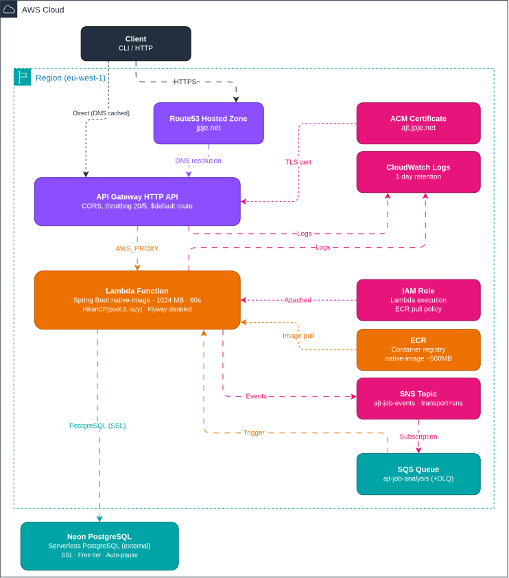

# AJT Serverless: AWS Lambda + API Gateway

## Architecture



Lambda Web Adapter translates API Gateway HTTP events into HTTP requests for Spring Boot. Native-image binary cold-starts in ~300ms. Neon PostgreSQL is the only external dependency (outside AWS).

### Why Lambda + API Gateway over ECS Fargate

| Factor | Lambda | ECS Fargate |
|--------|--------|-------------|
| Idle cost | $0 | ~$10/mo (always-on ALB + task) |
| Cold-start penalty | ~300ms (native-image) | None |
| Operational surface | IAM + log group only | Cluster, service, task def, ALB, ASG, SG |
| Traffic pattern | Spikey (personal job tracker) | Better for steady load |

Lambda's cold start is negligible for this use case (single-user CLI). The cost and operational savings dominate.

### Flyway strategy

**Disabled on Lambda**: schema migrations are a deployment-time concern, not a runtime one. Run them as a one-shot step before deploying a new Lambda version (see [Migrations](#migrations)).

## Deploy

### Makefile (recommended)

```bash
# Full deploy: build → push → migrate → infra → smoke test
IA_C=terraform make deploy          # Terraform backend
IA_C=cloud-formation make deploy    # CloudFormation backend

# examples
IA_C=cloud-formation IMAGE_TAG=1.0.0 make infra test
IA_C=cloud-formation make all

# Tear down
IA_C=terraform make destroy

# Rollback (instant alias switch, no rebuild)
make rollback ROLLBACK_TO=2

# Canary, shifting 10% of traffic to v4 for 5 min
aws lambda update-alias --function-name ajt-serverless --name live \
  --function-version 4 \
  --routing-config AdditionalVersionWeights={3=0.1}

# Promote after validation
aws lambda update-alias --function-name ajt-serverless --name live \
  --function-version 4 \
  --routing-config AdditionalVersionWeights={}

make info   # Lambda config + alias listing
```

Image tag auto-derives from git SHA (`git-abc1234`). Each deploy publishes a new Lambda version and shifts the `live` alias. Rollback is an alias pointer change: instant, no rebuild.

### Option A: CloudFormation

```bash
# First-time setup (build + push + deploy)
export NEON_PASSWORD='...'
export LLM_API_KEY='sk-...'
./cloud-formation/start.sh buildImage

# Incremental deploy (image already in ECR)
ECR_IMAGE_TAG=git-abc1234 ./cloud-formation/start.sh

# Tear down
./cloud-formation/stop.sh
```

### Option B: Terraform

```bash
cd terraform

IMAGE_URI="$(aws ecr describe-repositories ...):git-abc1234" \
  NEON_PASSWORD='...' \
  JWT_SECRET='...' \
  LLM_API_KEY='sk-...' \
  HOSTED_ZONE_ID='Z...' \
  ./init-aws-plan.sh    # validate + plan

./apply-aws-plan.sh     # apply

# Tear down
./destroy-aws-plan.sh
```

The Terraform workspace is self-contained in `terraform/templates/` (provider, variables, outputs). Image build/push remains separate: Terraform only manages infrastructure.

## Security

| Layer | Mechanism |
|-------|-----------|
| Transport | TLS 1.2 via ACM certificate, DNS-validated |
| API auth | JWT (app-layer, validated by Spring Security) |
| Lambda URL | Public (auth decisions delegated to app) |
| API Gateway | Public with rate limiting (20 burst, 5/s) |
| Secrets | Env vars: `NEON_PASSWORD`, `JWT_SECRET`, `LLM_API_KEY` |
| IAM | Least-privilege: only Lambda execution + ECR pull |
| Encryption at rest | SNS topic: AWS-managed KMS (`alias/aws/sns`). SQS queues: AWS-managed SQS SSE |
| Database | SSL enforced, password auth, IP-restricted by Neon |

## Lambda configuration

| Setting | Value | Rationale |
|---------|-------|-----------|
| Memory | 1024 MB | Native-image perf sweet spot (CPU scales with RAM) |
| Timeout | 30 s | Covers Neon cold-start (auto-pause wake) + response |
| Ephemeral storage | 512 MB | Sufficient for native-image runtime |

## Operations

### Monitor

```bash
# Recent invocations (API function)
aws logs filter-log-events --log-group-name /aws/lambda/ajt-serverless \
  --query 'events[0:10].[timestamp,message]' --output table

# Recent invocations (worker function)
aws logs filter-log-events --log-group-name /aws/lambda/ajt-serverless-worker \
  --query 'events[0:10].[timestamp,message]' --output table

# Tail live
aws logs tail /aws/lambda/ajt-serverless --follow
aws logs tail /aws/lambda/ajt-serverless-worker --follow

# Queue depth (async tracking / analysis backlog)
aws sqs get-queue-attributes --queue-url <JOB_TRACKING_QUEUE_URL> \
  --attribute-names ApproximateNumberOfMessages
aws sqs get-queue-attributes --queue-url <JOB_ANALYSIS_QUEUE_URL> \
  --attribute-names ApproximateNumberOfMessages

# Messages stuck in DLQ (retried 3 times and failed)
aws sqs get-queue-attributes --queue-url <JOB_TRACKING_DLQ_URL> \
  --attribute-names ApproximateNumberOfMessages
aws sqs get-queue-attributes --queue-url <JOB_ANALYSIS_DLQ_URL> \
  --attribute-names ApproximateNumberOfMessages

# Drain a DLQ back after fixing the cause
aws sqs purge-queue --queue-url <JOB_TRACKING_DLQ_URL>
aws sqs purge-queue --queue-url <JOB_ANALYSIS_DLQ_URL>
```

### Debug

```bash
# Invoke with a test event
aws lambda invoke --function-name ajt-serverless --payload '{...}' output.json

# Check function configuration
aws lambda get-function-configuration --function-name ajt-serverless
```

### Migrations

Flyway runs as a standalone step (not on Lambda startup):

```bash
SPRING_PROFILES_ACTIVE=aws,db-migrate \
  NEON_PASSWORD='...' \
  java -jar bootstrap-server/target/bootstrap-server-*.jar
```

CI/CD pattern: add this step before deploying a new Lambda image:

```yaml
- name: Run database migrations
  run: |
    SPRING_PROFILES_ACTIVE=aws,db-migrate \
      NEON_PASSWORD=${{ secrets.NEON_PASSWORD }} \
      java -jar bootstrap-server/target/bootstrap-server-*.jar
```

## Cost

| Resource | Monthly |
|----------|---------|
| Lambda (1M req/mo + 512k GB-s) | Free tier |
| API Gateway (1M req/mo) | Free tier |
| SNS (100k publishes/mo) | Free tier |
| SQS (1M requests/mo) | Free tier |
| ECR (~500MB private) | ~$0.05 |
| Route53 hosted zone | $0.50 |
| CloudWatch Logs | ~$0.50 |
| Neon PostgreSQL | Free tier |
| **Total** | **~$1.05** |

### Async event flow (SNS fanout + SQS + worker Lambda)

`submitJobPosting` publishes a `JobPostingCreated` event to SNS, tagged with an
`eventType` message attribute. SNS fans the event out to two independent SQS
queues via subscriptions whose filter policy is `eventType=JobPostingCreated`.
AWS Lambda Event Source Mappings wake the dedicated `ajt-serverless-worker`
function as messages arrive; inside the worker, the Lambda Web Adapter forwards
each event to `POST /api/events/sqs`, where it is routed by source queue ARN:
tracking events create the SAVED application, analysis events run the AI analysis:

```
submitJobPosting (HTTP) → SNS topic ─(filter: eventType=JobPostingCreated)─┬→ SQS ajt-job-tracking ─(ESM)─→ worker → create tracking (SAVED)
                                                                           └→ SQS ajt-job-analysis  ─(ESM)─→ worker → AI analysis → persisted
```

The HTTP call returns immediately. There is no in-process polling thread: AWS
polls the queues on behalf of the worker, and each queue has its own dead-letter
queue. Failures are retried up to 3 times by SQS before landing in the
corresponding DLQ (`ajt-job-tracking-dlq` / `ajt-job-analysis-dlq`); duplicate
tracking events are acknowledged without reprocessing.

### Rollback

Both Lambda functions have a `live` alias (API Gateway routes to the API alias,
and the SQS Event Source Mappings target the worker alias). Rollback points the
alias elsewhere, so it is instant and needs no rebuild:

```bash
make rollback ROLLBACK_TO=2                       # API function
make rollback ROLLBACK_TO=2 FUNCTION=ajt-serverless-worker   # worker function
# or directly:
aws lambda update-alias --function-name ajt-serverless --name live \
  --function-version 2 --region eu-west-1
```

The previous version remains deployed and available: only the alias moves.

### Canary deploys

Lambda aliases support weighted routing. Use for gradual rollouts:

```bash
# Shift 10% of traffic to v4 (90% stays on v3)
aws lambda update-alias --function-name ajt-serverless --name live \
  --function-version 4 \
  --routing-config AdditionalVersionWeights={3=0.1}

# Monitor for errors, then promote
aws lambda update-alias --function-name ajt-serverless --name live \
  --function-version 4 \
  --routing-config AdditionalVersionWeights={}

# Or rollback: point alias back to v3
aws lambda update-alias --function-name ajt-serverless --name live \
  --function-version 3 \
  --routing-config AdditionalVersionWeights={}
```

## Infrastructure resources

Both IaC paths create the same resource set:

- **IAM roles**: `ajt-lambda-execution-role` (API: SNS publish) and `ajt-worker-execution-role` (worker: SQS poll) with `AWSLambdaBasicExecutionRole` + ECR pull policy
- **Lambda `ajt-serverless`**: Container image function (1024 MB, 60s, 512 MB ephemeral), auto-publishes versions on deploy
- **Lambda `ajt-serverless-worker`**: Container image function (1024 MB, 120s, 512 MB ephemeral, reserved concurrency 2), receives SQS events via Event Source Mappings and LWA pass-through to `POST /api/events/sqs`
- **Lambda alias `live`** (both functions): rollback = alias pointer change
- **Lambda URL**: Public function URL on the API function pointing to `$LATEST` (for testing/debugging)
- **API Gateway HTTP API**: `$default` route, `AWS_PROXY` to `live` alias, throttled 20/5
- **SNS topic `ajt-job-events`**: publishes `JobPostingCreated` events, SSE with AWS-managed KMS (`alias/aws/sns`)
- **SQS queue `ajt-job-tracking`**: async tracking workload, visibility timeout 30s, DLQ after 3 failures, AWS-managed SQS SSE
- **SQS DLQ `ajt-job-tracking-dlq`**: dead-letter queue for failed tracking events
- **SQS queue `ajt-job-analysis`**: async analysis workload, visibility timeout 120s, DLQ after 3 failures, AWS-managed SQS SSE
- **SQS DLQ `ajt-job-analysis-dlq`**: dead-letter queue for failed analysis events
- **SNS subscriptions**: fan out `eventType=JobPostingCreated` to both queues (raw message delivery)
- **ACM certificate**: DNS-validated for `ajt.jpje.net`
- **API Gateway domain name**: Regional endpoint, TLS 1.2
- **Route53 records**: DNS validation CNAME + A alias to API Gateway domain
- **CloudWatch log groups**: `/aws/lambda/ajt-serverless`, `/aws/lambda/ajt-serverless-worker`, API Gateway (1-day retention)

Templates: CloudFormation (`cloud-formation/ajt-serverless-stack.yml`) | Terraform (`terraform/templates/main.tf`)

## Links

1. [AWS CloudFormation](https://eu-west-1.console.aws.amazon.com/cloudformation/home?region=eu-west-1)
2. [AWS ECR (private)](https://eu-west-1.console.aws.amazon.com/ecr/repositories/private/546053716955/ajt-serverless)
3. [AWS Lambda](https://eu-west-1.console.aws.amazon.com/lambda/home?region=eu-west-1)
4. [AWS API Gateway](https://eu-west-1.console.aws.amazon.com/apigateway/home?region=eu-west-1)
5. [AWS CloudWatch Logs](https://eu-west-1.console.aws.amazon.com/cloudwatch/home?region=eu-west-1)
6. [AWS Certificate Manager](https://eu-west-1.console.aws.amazon.com/acm/home?region=eu-west-1)
7. [AWS Route53](https://console.aws.amazon.com/route53/home?region=eu-west-1#HostedZones:)
8. [AWS SNS](https://eu-west-1.console.aws.amazon.com/sns/v3/home?region=eu-west-1)
9. [AWS SQS](https://eu-west-1.console.aws.amazon.com/sqs/home?region=eu-west-1)
10. [Neon Console](https://console.neon.tech)
