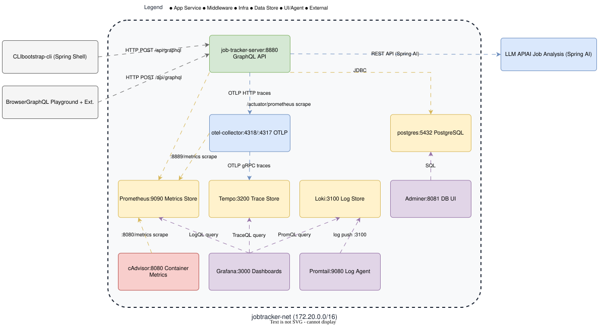

# alexandra-job-tracker (compose)

## Summary

This environment runs the job-tracker server under `docker-compose` for development.

It starts the server with an observability stack (OpenTelemetry collector, Prometheus, Grafana, Tempo, Loki) and container monitoring (cadvisor). The server can be built in JVM mode (default) or native mode.

## Architecture



Docker Compose runs each service in its own container, which keeps local development close to the deployed stack.

## Usage

```bash
cd deploy/compose

# Start with JVM build (default)
./start.sh

# Start with native-image build
./start.sh native

# Stop and clean up
./stop.sh

# Stop and also remove built images
./stop.sh removeImages
```

## Links

* Job Tracker (API):
  * [GraphQL API](http://localhost:8880/api/graphql)
  * [GraphiQL IDE](http://localhost:8880/api/graphiql)
  * [H2 Console](http://localhost:8880/api/h2-console) (JDBC URL: `jdbc:h2:file:./deploy/data/jobtracker;AUTO_SERVER=TRUE`, user: `sa`, password: _blank_)
  * [Actuator health](http://localhost:8880/api/actuator/health)
* Observability:
  * [Prometheus dashboard](http://localhost:9090)
  * [Tempo search](http://localhost:3200/status)
  * [Loki dashboard](http://localhost:3100/services/loki)
  * [Grafana dashboard](http://localhost:3000) (admin / admin)
  * [Cadvisor dashboard](http://localhost:8080)
* k6 (performance and security testing):
  * Runs load, spike, soak, and security scripts from `testing-pentest/src/test/k6/`
  * Activated with `docker compose --profile perf-test up` or `docker compose --profile pen-test up`
* ZAP (penetration testing):
  * Runs an automated OWASP scan against the GraphQL endpoint
  * Activated with `docker compose --profile pen-test up`

## Validate the changes

```bash
# Check server health
curl -s http://localhost:8880/api/actuator/health | jq .

# Verify all services are running
docker compose ps

# Query GraphQL API
curl -s -X POST http://localhost:8880/api/graphql \
  -H "Content-Type: application/json" \
  -d '{"query": "{ __schema { queryType { name } } }"}'

# Check Prometheus targets
curl -s http://localhost:9090/api/v1/targets | jq '.data.activeTargets[].labels.job'

# Verify traces reach Tempo
curl -s http://localhost:3200/api/echo
```
